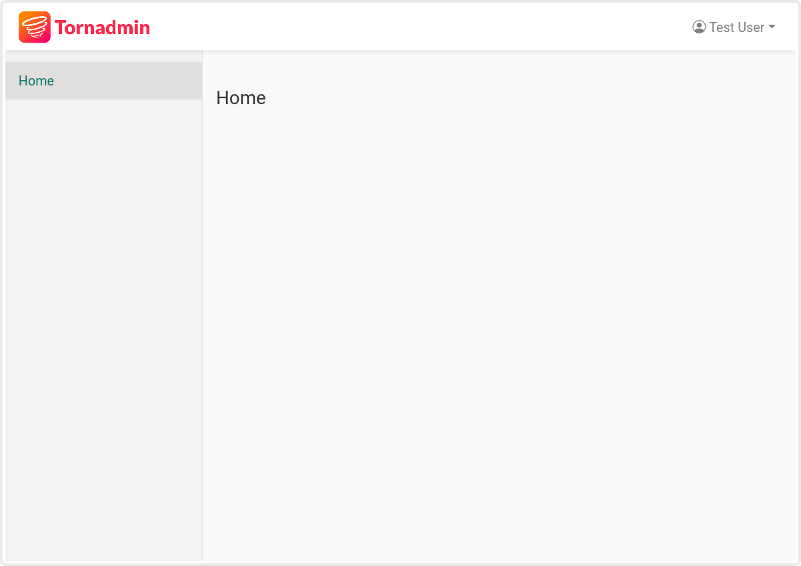

Quickstart
==========

Tornadmin is inspired by Django admin but with more flexiblity in mind.

Creating the admin site
-----------------------

Here's a quick and dirty way to setup the admin site:

.. code-block:: python

    # app.py

    from tornado import ioloop, web

    from tornadmin import (
        BaseAdminSite,
        AdminRouter,
        uimodules as tornadmin_uimodules
    )

    # Subclass the BaseAdminSite
    # This will be useful for adding authentication later
    class AdminSite(BaseAdminSite):
        pass

    # create an instance of AdminSite
    admin_site = AdminSite(base_url='/admin')

    def make_app()
        return web.Application(
            [
                # ... your app's other routes ...

                AdminRouter(admin_site), # add admin site's route to your app
            ],
            debug=True,
            uimodules=[tornadmin_uimodules], # add admin site's uimodules
        )

    if __name__ == '__main__':
        app = make_app()
        app.listen(8888)
        print('Listening at 8888...')
        ioloop.IOLoop.current().start()

Of course, it will be much better to put the admin code in a separate file, but this is a quickstart guide, so...

Viewing the admin site
----------------------

Now go to ``127.0.0.1:8888/admin`` to view the site in action.

It should look something like this:

